## YouTube Analysis

### Background Statistics

Youtube launched on February 14th, 2005 by Steve Chen, Chad Hurley, and Jawed Karim. Now it is the 2nd most visited website in the world. According to [MerchDope](https://merchdope.com/youtube-stats/), the total number of people who use YouTube have reached to 1,300,000,000 with over 30 million visitors per day. Almost 5 billion videos are watched on Youtube every single day with an average number of mobile YouTube video views per day is 1 billion.

### Let's Talk Money

The World highest paid YouTube stars earned a combined total of $127 million in 2017. This is a huge increase compared to $54.5 million in 2015. The number of channels earning six figures per year on YouTube is up 50% y/y. with the rising number of users and viewers, individuals have started to turn to YouTube in hopes to become the next YouTube star. 

Being in the country where YouTube was born, we want to know how to generate more views on YouTube as YouTubers are getting paid by no. of views.

Shape of the Data

* 40,949 entries

* 6,354 unique videos

* Highest views = 225m

* Average views = 2m

* Minimum view = 559

#### Unique Videos View Counts Graph
This graph shows the ipact of the highly varied data, with a mean of only 700k, but a high of 225m. 

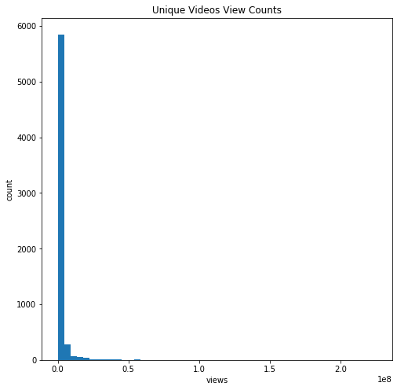

#### Days trending out of 150 graph
This graph shows that a video that trends doesn't trend for just one day, they  tend to trend for one to four weeks. That said, there is little correlation between how many days it trends and how many views it gets. 

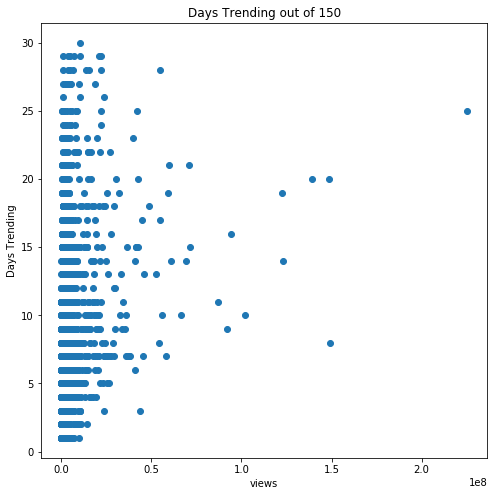

#### Number of tags graph
This graph shows that the number of tags on a video varies from zero up to about 50, with few having more. Fairly amazing that 40 tags is not unusual. 

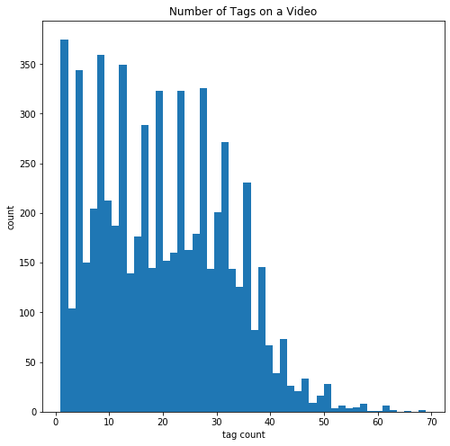

#### Importance of category graph
This graph shows the importance of category. 40% of the categories have zero trenders in the sample and two categories had all the big winners. 

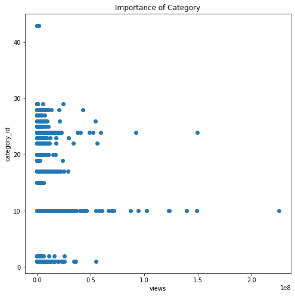

#### Number of tags on video graph
This graph shows that the number of tags on the video does not appear to correlate to its views. 

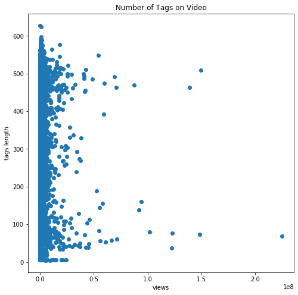

### Both length of title graphs
These two graphs show that the lenght of title does not correlate. The second one is interesting as it shows all samples and you can see the winning videos trending up. 

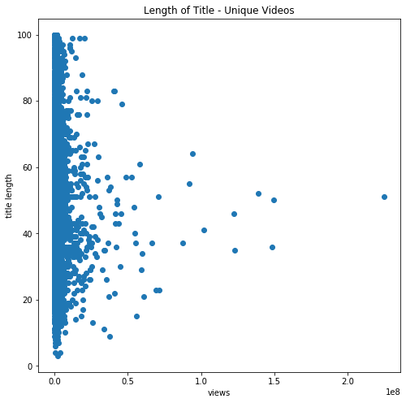
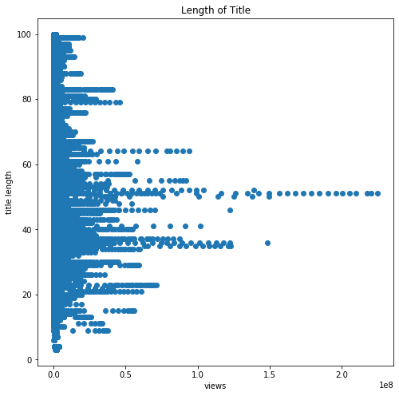

### Both Likes + Dislikes graphs
We found that Likes + Dislikes is the best predictor of views. Likes is good, but Likes + Dislikes is slightly better at r-squared of over 0.85

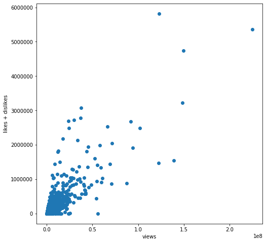
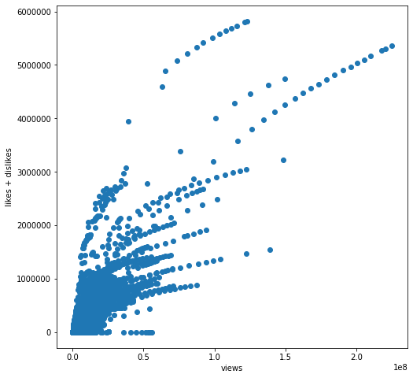

### Views by Dislikes

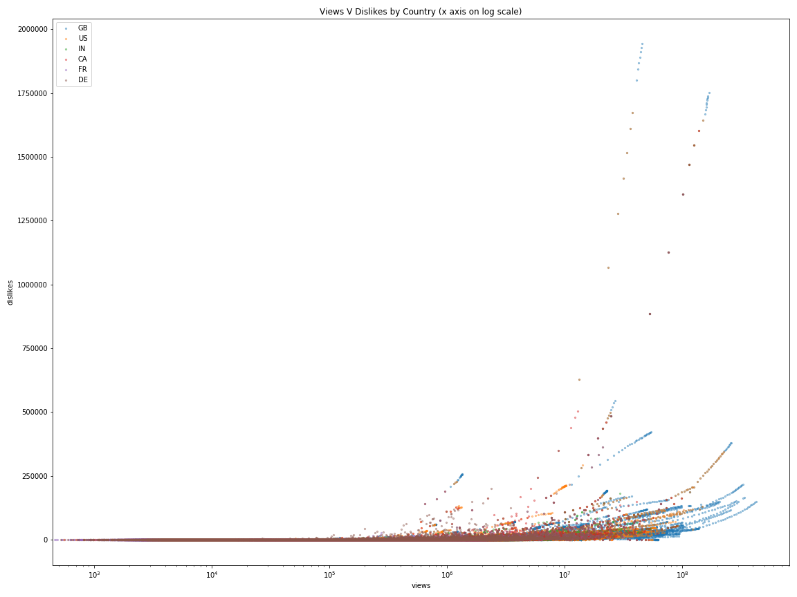

### Views by Likes

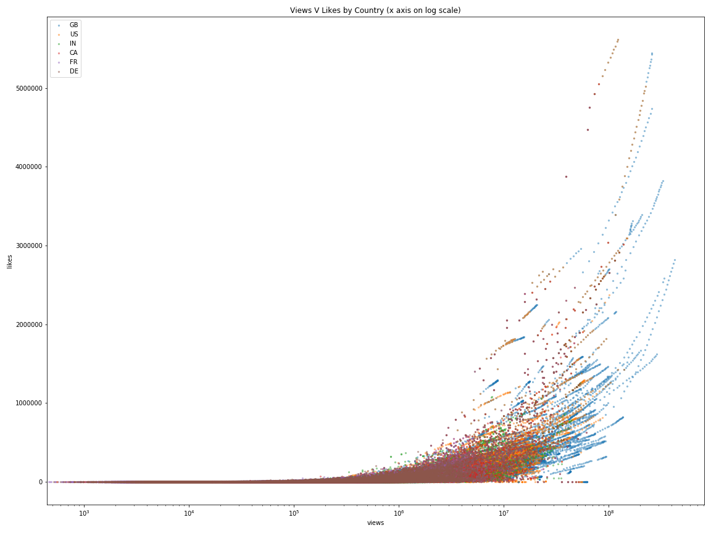